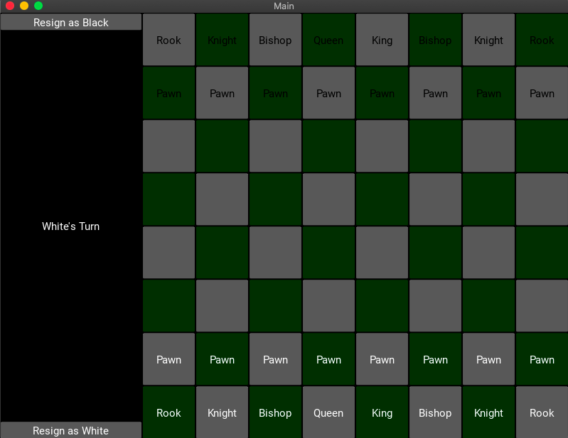

# Chess-Python

This is a fully functional chess program that was created with Python, Kivy and object oriented programming principles. The game implements castling, pawn promotion, au passant, and stalemate.

Requirements.txt contains the dependencies to run the project.
Running "python3 main.py" will run the program.

Image showing the starting position:

Image showing castling:

![Castling][Castling.png]

Image showing pawn promotion. In the top right, white has promoted to a queen. In the bottom left, black is about to promote and has button options to choose which piece to promote to:

![Promotion][Promotion.png]

Image showing checkmate and option to start new game:

![Checkmate][Checkmate.png]
